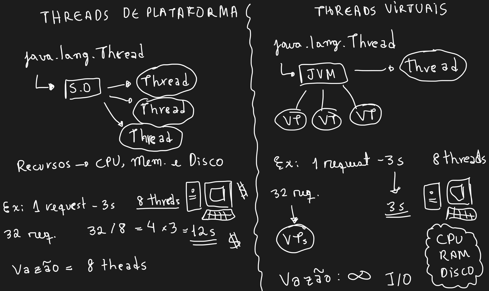
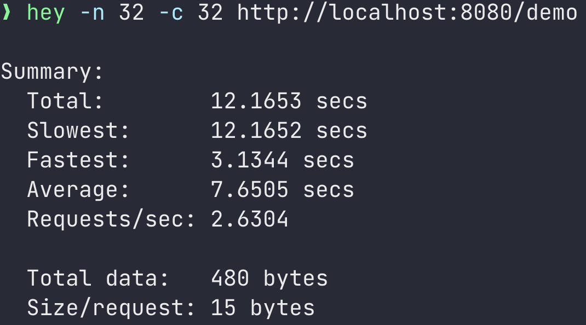
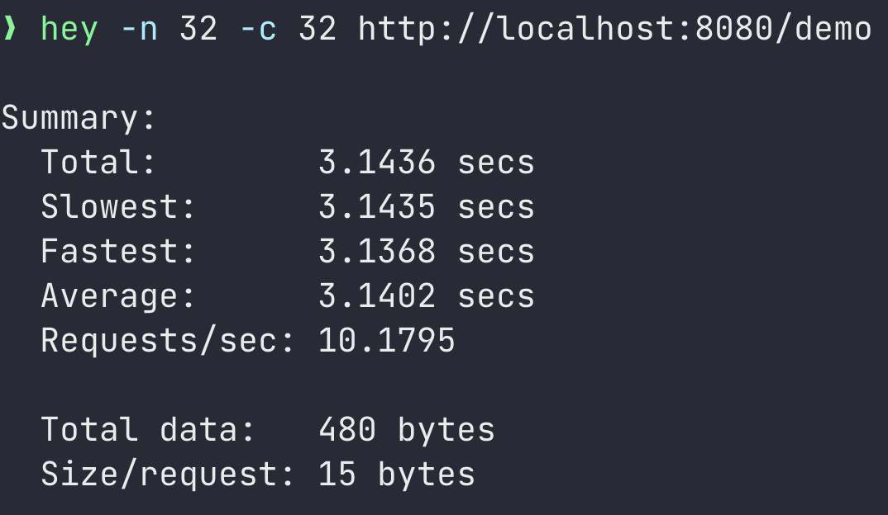

<h1 align="center">
  Virtual Threads Spring Boot
</h1>

<p align="center">
 
 
</p>

Demo apresentada [nesse vídeo](https://youtu.be/a8gMokxIt4Q) para comparar a abordagem de virtual threads com a de threads de plataforma.

## Teoria


## Benchmark

Esse teste foi feito num computador que possui 8 núcleos, portanto foram utilizadas 32 threads para comparação.

- Abordagem Platform Threads (32 threads / 8 núcleos = 4 * 3s = 12s):
```
$ hey -n 32 -c 32 http://localhost:8080/demo
```


- Abordagem Virtual Threads (32 threads virtuais = 3s):
```
hey -n 32 -c 32 http://localhost:8080/demo
```
